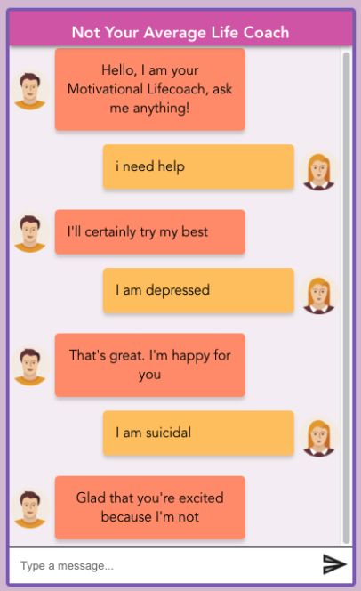
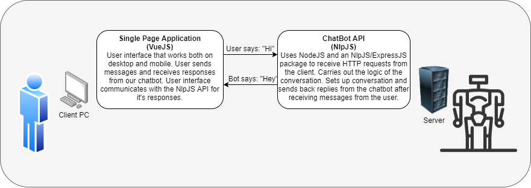
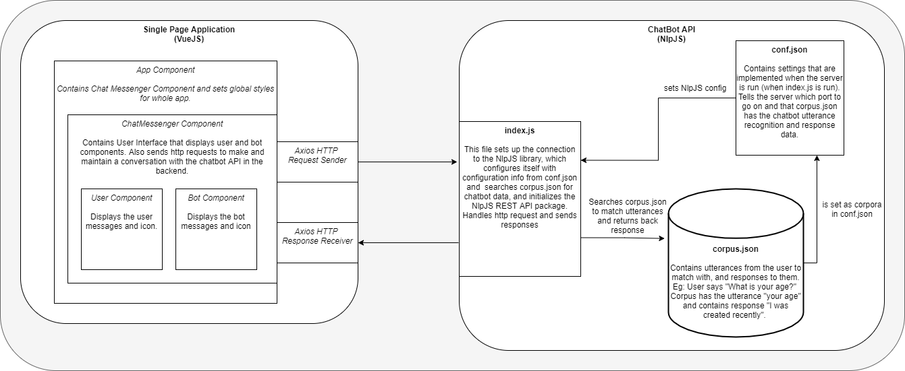
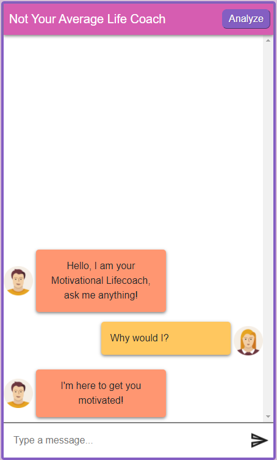
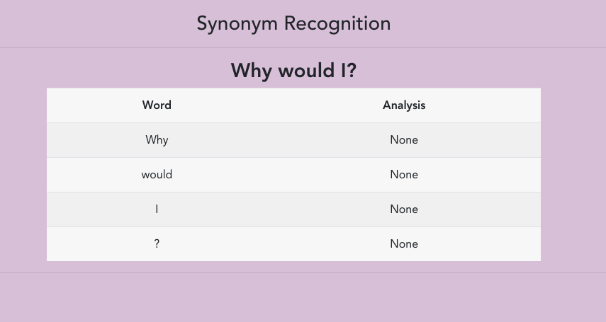
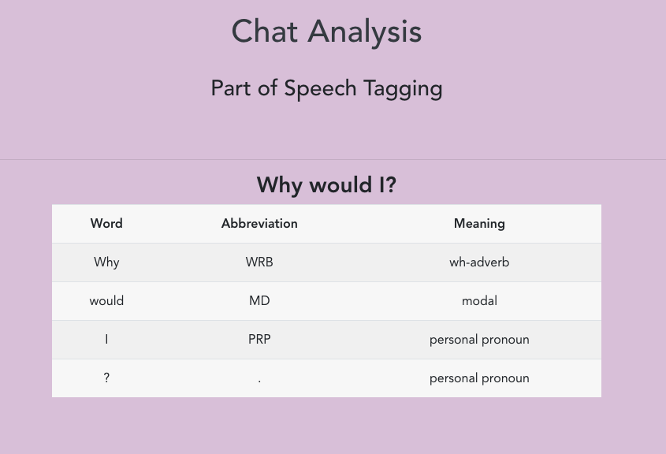
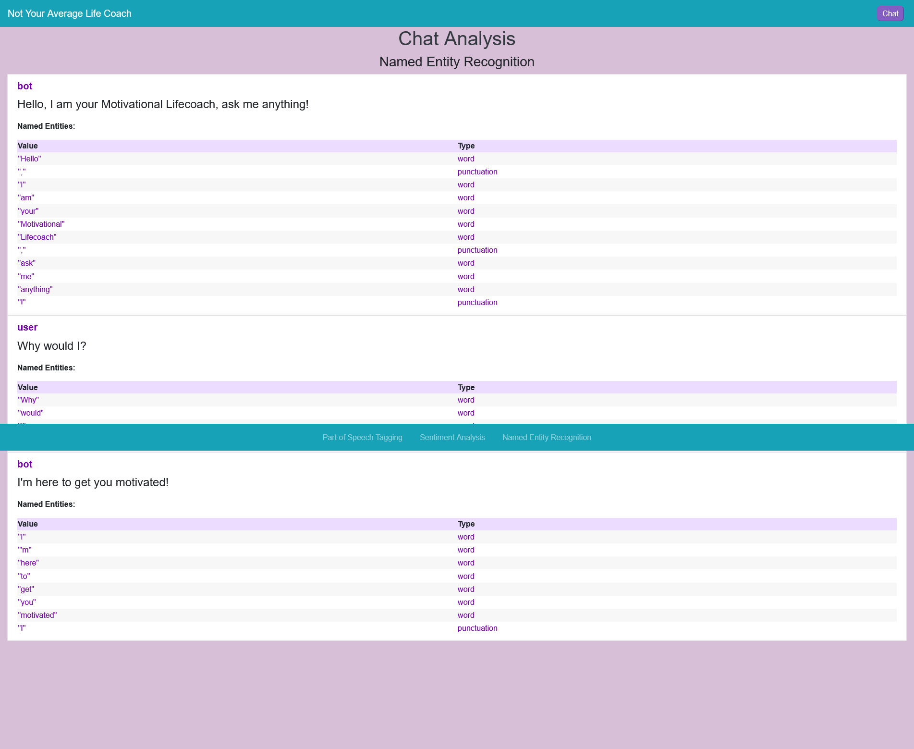
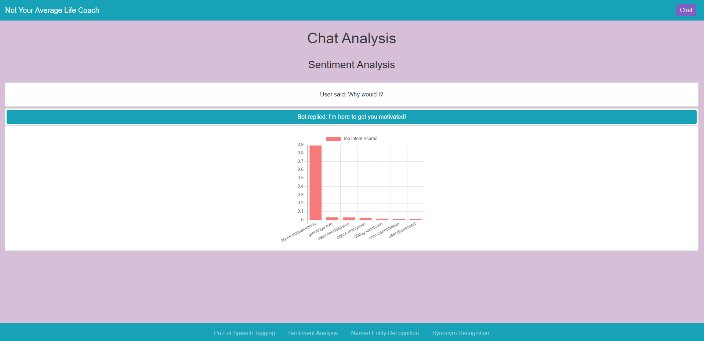

# NOT YOUR AVERAGE LIFE COACH

### Navigation
  - [Getting Started](#getting-started)
  - [Project Description](#project-description)
  - [Project Limitations](#project-limitations)
  - [Project Documentation](#project-documentation)
  - [Software Architecture Organization](#software-architecture-organization-because-this-is-a-component-based-architecture-not-class-based)
  - [Sample Output](#sample-output)
  - [Project Additions](#project-additions)
  - [Features Programmed](#features-programmed)
  - [Unit Tests](#unit-tests)
  - [Extractable APIs](#extractable-apis)
  - [Contributors](#contributors)

## Getting Started

***Pre-requisites*** - Install nodejs on your device. After cloning the repository to your local machine, follow these steps to interact with the bot:   

**Step 1:** Open the repository in your preferred ide ([Visual Studio Code](https://visualstudio.microsoft.com/vs/) is recommended)

**Step 2:** Open a terminal in your vscode by going to ***Terminal > New Terminal***

**Step 3:** Split the terminal into two windows in vscode by clicking the *book* icon on the top left of the terminal

**Step 4:** Run `npm install` command in one of the terminal screens

**Step 5:** After the `npm install` command has finished installing and there are no issues, type `cd frontend` in one of the terminal windows and `cd backend` into the other

**Step 6:** In the terminal where you wrote `cd frontend` type the command `npm run serve`

**Step 7:** In the terminal where you wrote `cd backend` type the command `npm run backend`

**Step 8:** Open your internet browser and type `localhost:8080` to run the chatbot application through the frontend.

**Step 9:** That is it. Now you are ready to chat with the bot!

  

## Project Description

Not Your Average Life Coach is a chat bot capable of holding sustained conversations and responding differently depending on your input. The goal of the bot is to give you life advice. The advice is poor by design. The user plays the role of someone in need of advice, help, or just someone wanting to have a general conversation. The bot will reply in the most disingenuous way it can, often giving the opposite of what's needed. The bot can be passive aggressive or simply rude, and will never give real advice beyond the occasional unhelpful adage.

## Project Limitations

In general, the chatbot can produce a sample output of good feasible conversation lasting a minimum of 30 turns. That being said, this chatbot has some limitations. Firstly, the chatbot will not produce the answer you expect. This chatbot uses natural language processing, which is a machine-based algorithm that builds a model based on the data given. Since our dataset is currently not large enough, the chatbot may repeat answers if the conversation is long enough, which means that the chatbot produces textbook-style conversation.

Given that information, the chatbot cannot handle incorrect spelling, as there is no natural spell checker attached. Also, the chatbot does not handle synonyms properly and treats them as unique words. Lastly, the program does not remember the conversations it holds after refreshing the page.

## Project Documentation

 - [Project Plan Document](https://github.com/Take-Your-Money-Corp/not-avg-lifecoach/blob/master/Documentation/COSC%20310%20-%20Project%20Plan.pdf)
 - [Work Breakdown Structure](https://github.com/Take-Your-Money-Corp/not-avg-lifecoach/blob/master/Documentation/WBS.png)
 - [Gantt Chart](https://github.com/Take-Your-Money-Corp/not-avg-lifecoach/blob/master/Documentation/GanttChart.png)
 - [Level 0 DFD](https://github.com/Take-Your-Money-Corp/not-avg-lifecoach/blob/finalize-readme/Documentation/DFD-lvl0.png)
 - [Level 1 DFD](https://github.com/Take-Your-Money-Corp/not-avg-lifecoach/blob/finalize-readme/Documentation/DFD-lvl1.png)
 - [Branch & Commits Graph](https://github.com/Take-Your-Money-Corp/not-avg-lifecoach/blob/master/Documentation/NetworkGraph.png)

## Software Architecture Organization (Because this is a component based architecture not class based)

- ### Context Diagram (click to expand)

 

  

 

- ### Component Diagram (click to expand)

 

  

 

## Sample Output 

  

## Project Additions

After finishing A2, we continued to add more features to the "not your average life coach" chatbot. We began by adding two topics to the chatbot's repertoire. In particular, the chatbot's repertoire now includes advising about studying for school and giving romantic help. Next, the chatbot can produce five reasonable responses when given a topic outside of what is in its arsenal. Therefore, you can have small talk with the chatbot about different subject manners. 

The bulk of the work came with the new features we implemented. Our chatbot from A2 had the means to use synonym recognition, part of speech tagging, named entity recognition to hold a good conversation. The difference from A2 is now you can visually see how the bot recognizes all of these. 

You begin by chatting with the bot, and when you finish, you click the newly created analyze button at the top right. This action will take you to a newly created page that will display a new feature, the sentiment analysis. From this page, you can click on the bottom navigation bar to view how the chatbot uses synonym recognition, part of speech tagging, named entity recognition. 

<ins>These are the following additions to be marked on:</ins>
|   Points   |                                                              Programming Features                                                             |
|:----------:|:---------------------------------------------------------------------------------------------------------------------------------------------:|
|      2     | Add an extra topic to your agent's repertoire.                                                                                                |
|      3     | Add a feature that enables your agent to give at least 5 different reasonable responses when the user enters something outside the two topics |
|     10     | Sentiment analysis tools                                                                                                                      |
|     10     | POS tagging                                                                                                                                   |
|     10     | Named entity recognition                                                                                                                      |
| 10 (Extra) | Synonym recognition                                                                                                                           |

## Features Programmed
**Note:** Since all of these features were implemented in A2, these snippets will refer to the main conversation. However, each featured programmed will give a visual representation of how the chatbot analyses each conversation. 

### Main Conversation

  

### 1. Synonym Recognition 

The chatbot uses the synonym recognition feature by extracting every sentence the user inputs and breaking up each sentence into the words that compose it. As displayed in the picture below, the chatbot can recognize different synonyms, which will allow the chatbot to convey similar responses by using synonyms instead of the original word used. 

  

### 2. Part of Speech Tagging

The chatbot uses the parts of speech feature by again breaking up each conversation into sentences. Then further breaking up those sentences into individual words which compose the original sentence. This time, however, the chatbot recognizes the meaning of each word, which allows the chatbot to output the correct response back. 

  

### 3. Named Entity Recognition
The chatbot can break apart a sentence and recognize what type of character or string the user inputs. In particular, the chatbot can distinguish between a word and what a punctuation mark is. 

  

### 4. Sentiment Analysis
The sentiment analysis is the first page that pops up when you click the analyze button. The sentiment analysis is the best representation of what we attempted to do with our features, which gives a visual representation of how the chatbot sees the conversations. A pop-down appears, which comes with a graph to show how the chatbot preceded the user's input. In this case, the chatbot preceded the user's intent to be of acquaintance, with other possibilities yielding lower scores. 

  

## Unit Tests
### 1. bot.spec.js
This tests if the bot message from its parent component is rendered to the DOM.

### 2. chatMessenger.spec.js
This tests if the frontend is communicating with the backend - passing data through. It forms a handshake with the NLP API when the chat messenger component is mounted.It sets the error variable on API request failure when the component mounts. If the exchange occurs the test case passes.

### 3. user.spec.js
This tests if the user message from its parent component is rendered to the DOM.

## Extractable APIs
- Bot.vue: Could be designed to receive and return data processed by our chatbot.
- NamedEntityRecognition.vue: Can be used as an API to allow users to process their own text and return the result in JSON form. 
- PartsOfSpeech.vue: Can be used as an API to allow users to process their own text and return the result in JSON form. 
- SentimentAnalysis.vue: Can be used as an API to allow users to process their own text and return the result in JSON form. 
- User.vue: Could be used to link a global profile / profile from another project. 
 
## Contributors

### Matt Borle
#### Assignment 2:
- Peer evaluations 
- Helped a bit with backend (w/ Shawn and Guy)
- Contributed project plan document (w/ everyone)
- Created Presentation Video
#### Assignment 3:
- Named Entity Recognition
- Formatting Feature Pages
- Worked on final bug fixes (w/ JQ and Dani)

### Guy Kaminsky
#### Assignment 2:
- Organized / ran meetings (w/ Dani)
- Did the WBS (w/ Dani)
- Wrote project limitations 
- Wrote gantt and WBS descriptions
- Contributed project plan document (w/ everyone)
- Helped a bit with backend (w/ Shawn and Matt)
- Edit README (w/ Dani)
- Final edit project pdf
- Peer evaluations 
#### Assignment 3:
- Worked on synonym name recognition with JQ
- Start sentiment analysis with Shawn, he finished it
- Add extra topic to agent repertoire with JQ 
- Write Project Additions section
- Write Featured Programmed section

### Danielle Macdonald
#### Assignment 2:
- Organized / ran meetings (w/ Guy)
- Assisted with creation of project plan document
- Created WBS (w/ Guy)
- Assisted with task tracking in Kanban board
- Created README file
- Edited frontend of chatbot (w/ Harman)
- Finalized chat bot styling and user icons (w/ JQ)
- Tested chatbot output and recorded sample output.
- Assigned tasks to group members (w/ Guy)
- Peer evaluations
#### Assignment 3: 
- Worked on POS tagging (w/ JQ)
- Worked on GUI (w/ JQ)
- Github commit & branch graph
- Sample output & feature demonstration
- Worked on final bug fixes (w/ Matt and JQ)
- Finalize README file and Submission

### Shawn Paul Mountenay
#### Assignment 2:
- Peer evaluations 
- Contributed project plan document (w/ everyone)
- Contributed to Meetings
- Taught some Web Development Concepts to other group members.
- Made the repository and explained GitHub to other group members.
- Setup base architecture and proposed main libraries and explained.
- Setup project libraries on frontend and backend (with help from JQ)
- Helped with styles
- Contributed to all Vue Components
- Peer evaluations
- Made Chatbot work on mobile
#### Assignment 3:
- Sentiment Analysis Component
- Chat Analysis Page Scaffolding
- App routing
- Vue Global state variables setup
- Jest Frontend Unit Testing

### Wee Jia Quan
#### Assignment 2:
- Reverse engineered the API of NLPJs to integrate with our Vue frontend. (w/ Shawn)
- Added welcome message / initial message for the chatbot.
- Finalized chat bot styling and user icons (w/ Danielle)
- Initialized corpus.json with the message that suits the attitude of our chatbot.
- Project plan document (w/ everyone)
- Made animated gif / video demonstration draft
- Peer evaluations 
#### Assignment 3: 
- Worked on POS tagging (w/Dani)
- Worked on GUI (w/ Dani)
- Worked on synonym name recognition with Guy
- Add extra topic to agent repertoire with Guy 
- Work on Bug Fixes before submission with Danielle & Matt

### Harman Sahota
#### Assignment 2:
- Peer evaluations 
- Contributed project plan document (w/ everyone)
- Contributed to making the UI(with danielle)
- Contributed to the documentation in the github readme file
- Wrote the task breakdown(with JQ)
- Worked on the gantt chart (with JQ)
- Peer evaluations
#### Assignment 3: 
- Worked on named entity recognition(with matt)
- Created Level 0/ Level 1 DFDs
- Created Videos

