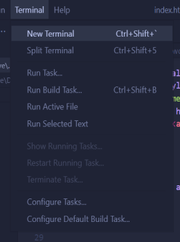
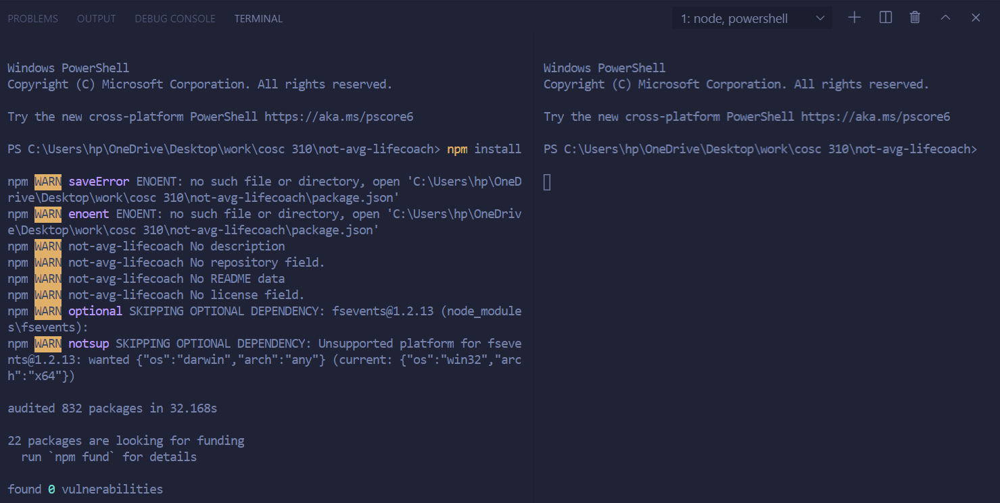
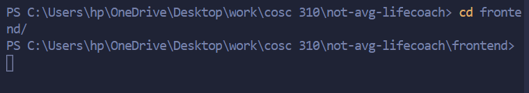
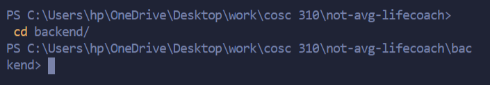
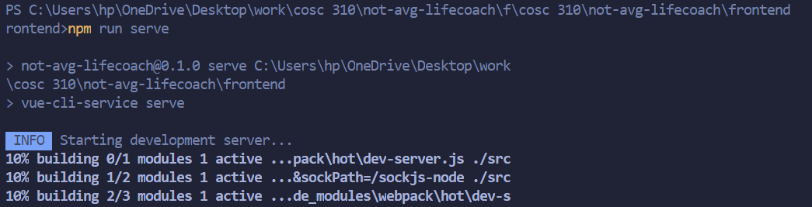
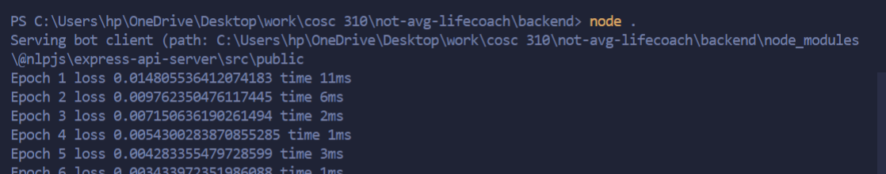
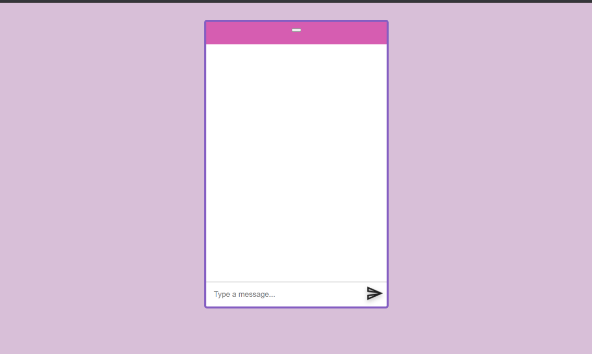

# NOT YOUR AVERAGE LIFE COACH

### Task List
- [Getting Started](#getting-started)
- [Project Description](#project-description)
- [Project Limitations](#project-limitations) 
- [Project Documentation](#project-documentation)
- [Class Organization](#class-organization)
- [Sample Output](#sample-output)
- [Contributors](#contributors)

## Getting Started
*pre requisites - node is installed on your device*
After Cloning the repository to your local machine , the following steps should lead you to successfully interact with the bot - 

**Step 1:** Open the repository in your preferred ide ([Visual studio](https://visualstudio.microsoft.com/vs/) code recommended)

**Step 2:** Open a terminal in your vscode by going to ***Terminal > New Terminal*** , as shown in the picture below

**Step 3:** Split the terminal into 2 in vscode by clicking the *book* icon on the top left of the terminal

**Step 4:** run ***npm install*** command in one of the terminal screens

**Step 5:** after npm install command finished installing and there are no issues , type *cd frontend/* in one of the terminal and ***cd backend/*** into the other

**Step 6:**  in the terminal with ***cd frontend/*** type *npm run serve*

**Step 7:** in the terminal with ***cd backend/*** type *node . *

**Step 8:** open browser and type ***locahost/***

**Step 9:** chat with the bot ! 

## Project Description

&nbsp;&nbsp;&nbsp;&nbsp;Not Your Average Life Coach is a chat bot capable of holding sustained conversations and responding differently depending on your input. The goal of the bot is to give you life advice. The advice is poor by design. The user plays the role of someone in need of advice, help, or just someone wanting to have a general conversation. The bot will reply in the most disingenuous way it can, often giving the opposite of what's needed. The bot can be passive aggressive or simply rude, and will never give real advice beyond the occasional unhelpful adage.

## Project Limitations
&nbsp;&nbsp;&nbsp;&nbsp;In general, the chatbot can produce a sample output of good feasible conversation lasting a minimum of 30 turns. That being said, this chatbot has some limitations. Firstly, the chatbot will not produce the answer you expect. This chatbot uses natural language processing, which is a machine-based algorithm that builds a model based on the data given. Since our dataset is currently not large enough, the chatbot may repeat answers if the conversation is long enough, which means that the chatbot produces textbook-style conversation.

## Project Documentation
 - [Work Breakdown Structure](https://github.com/Take-Your-Money-Corp/not-avg-lifecoach/blob/master/Documentation/WBS.png)
 - [Gantt Chart](https://github.com/Take-Your-Money-Corp/not-avg-lifecoach/blob/master/Documentation/GanttChart.png)

## Class Organization

## Sample Output 

  

## Contributors
